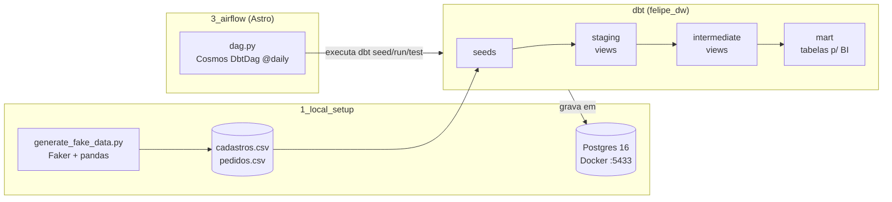

# airflor_dbt_astro

Pipeline de dados de ponta a ponta, feito para estudo: **gera dados falsos → carrega num Postgres → transforma com dbt → orquestra com Airflow (Astro + Cosmos)**.

> Este README é também um material de estudo. As seções 4 e 5 explicam a DAG linha a linha, e a seção 7 lista o que ainda está errado no projeto.

---

## Sumário

1. [Visão geral](#1-visão-geral)
2. [Estrutura de pastas](#2-estrutura-de-pastas)
3. [Como rodar](#3-como-rodar)
4. [A DAG explicada linha a linha](#4-a-dag-explicada-linha-a-linha)
5. [O que o Cosmos faz por baixo (e como escrever sem ele)](#5-o-que-o-cosmos-faz-por-baixo-e-como-escrever-sem-ele)
6. [Modelos dbt: o que cada um faz](#6-modelos-dbt-o-que-cada-um-faz)
7. [Pendências conhecidas (fundamentos a corrigir)](#7-pendências-conhecidas-fundamentos-a-corrigir)
8. [Próximos passos: CI/CD e processamento](#8-próximos-passos-cicd-e-processamento)

---

## 1. Visão geral



| Etapa | Ferramenta | Papel |
|---|---|---|
| Gerar dados | Python, Faker, pandas | 20 mil clientes e 50 mil pedidos em CSV |
| Armazenar | Postgres 16 (Docker) | O "data warehouse" |
| Transformar | dbt-core + dbt-postgres | SQL versionado, em camadas, com testes |
| Orquestrar | Airflow (Astro Runtime) + Cosmos | Roda o dbt todo dia, com retry, logs e UI |

---

## 2. Estrutura de pastas

```
airflor_dbt_astro/
├── 1_local_setup/            # infra local + gerador de dados
│   ├── docker-compose.yml    # sobe o Postgres (porta 5433 no seu PC → 5432 no container)
│   ├── generate_fake_data.py # gera ./dados_gerados/*.csv
│   ├── pyproject.toml        # dependências (gerenciadas com uv)
│   └── .env                  # DBT_USER / DBT_PASSWORD  (NÃO versionar)
│
├── 2_data_warehouse/felipe_dw/   # versão antiga do projeto dbt (sem a camada mart)
│
└── 3_airflow/                # projeto Astro (criado com `astro dev init`)
    ├── Dockerfile            # imagem do Airflow + venv separada com o dbt
    ├── requirements.txt      # pacotes Python do Airflow (astronomer-cosmos)
    ├── dags/dag.py           # a DAG do pipeline
    └── dbt/felipe_dw/        # projeto dbt ATUAL (é esse que o Airflow roda)
        ├── dbt_project.yml
        ├── packages.yml      # dbt_utils, dbt_expectations
        ├── seeds/            # CSVs carregados com `dbt seed`
        └── models/
            ├── staging/
            ├── intermediate/{dim,fact}/
            └── mart/
```


---

## 3. Como rodar

### Pré-requisitos
- Docker Desktop
- [uv](https://docs.astral.sh/uv/) (gerenciador de pacotes Python)
- [Astro CLI](https://www.astronomer.io/docs/astro/cli/install-cli)

### 3.1 Subir o Postgres

```bash
cd 1_local_setup
```

Crie o arquivo `1_local_setup/.env`:

```env
DBT_USER=seu_usuario
DBT_PASSWORD=sua_senha
```

```bash
docker compose up -d
```

O banco `dbt_db` fica disponível em `localhost:5433`.

### 3.2 (Opcional) Gerar novos dados

```bash
uv sync
```

```bash
uv run python generate_fake_data.py
```

Os arquivos são gravados em `1_local_setup/dados_gerados/`. Para usá-los, copie-os para `3_airflow/dbt/felipe_dw/seeds/`.

### 3.3 Rodar o dbt direto do seu PC (sem Airflow)

O dbt procura as credenciais em `~/.dbt/profiles.yml`:

```yaml
felipe_dw:              # tem que ser igual ao `profile:` do dbt_project.yml
  target: dev
  outputs:
    dev:
      type: postgres
      host: localhost
      port: 5433
      user: seu_usuario
      password: sua_senha
      dbname: dbt_db
      schema: public
      threads: 4
```

```bash
cd 3_airflow/dbt/felipe_dw
```

```bash
dbt deps
```

```bash
dbt build
```

`dbt deps` baixa os pacotes. `dbt build` roda, em ordem de dependência, os comandos `seed`, `run`, `test` e `snapshot`. Use `dbt debug` para testar a conexão.

### 3.4 Rodar pelo Airflow

```bash
cd 3_airflow
```

```bash
astro dev start
```

A UI abre em http://localhost:8080. Antes de disparar a DAG, crie a **Connection** `postgres_dw`, pela UI (*Admin → Connections*) ou pelo arquivo `3_airflow/airflow_settings.yaml`, que já está no `.gitignore`:

```yaml
airflow:
  connections:
    - conn_id: postgres_dw
      conn_type: postgres
      conn_host: host.docker.internal   # o Airflow roda em container; "localhost" seria o próprio container
      conn_port: 5433
      conn_schema: dbt_db               # no Airflow, o campo "schema" da conexão Postgres é o DATABASE
      conn_login: seu_usuario
      conn_password: sua_senha
```

> **Por que `host.docker.internal`?** O Postgres está exposto no seu PC, na porta 5433. Dentro do container do Airflow, `localhost` aponta para o próprio container. `host.docker.internal` é o nome que o Docker Desktop dá para a sua máquina.

---

## 4. A DAG explicada linha a linha

Arquivo: [`3_airflow/dags/dag.py`](3_airflow/dags/dag.py)

### Primeiro, como o Airflow "acha" a DAG

O Airflow **não chama nenhuma função `main`**. Um processo, o *dag-processor*, **importa** cada `.py` da pasta `dags/` a cada poucos segundos e procura **objetos do tipo `DAG` no escopo global do módulo**. Por isso a DAG é criada numa variável solta no fim do arquivo (`dbt_cosmos_dag = DbtDag(...)`), e não dentro de uma função.

Consequência prática: **tudo que está no topo do arquivo roda a cada parse**. Nada de query em banco ou chamada de API ali.

### Os imports

```python
import os                        # não é usado (pode remover)
from datetime import datetime    # para o start_date
from pathlib import Path         # caminho do projeto dbt, de forma portável

from airflow import DAG          # não é usado: o DbtDag já É uma DAG (pode remover)
from cosmos import DbtDag, ProjectConfig, ProfileConfig, ExecutionConfig
from cosmos.profiles import PostgresUserPasswordProfileMapping
```

| Import | O que é, em termos de POO |
|---|---|
| `DbtDag` | **Subclasse de `DAG`** (`class DbtDag(DAG, DbtToAirflowConverter)`). Herda tudo da DAG (`dag_id`, `schedule`...) e, no `__init__`, lê o projeto dbt e cria as tasks sozinha. |
| `ProjectConfig` | Objeto de configuração: **onde** está o projeto dbt. |
| `ProfileConfig` | Objeto de configuração: **com quais credenciais** o dbt conecta. Substitui o `profiles.yml`. |
| `ExecutionConfig` | Objeto de configuração: **como** executar o dbt (qual executável, local/docker/k8s). |
| `PostgresUserPasswordProfileMapping` | "Tradutor" que transforma uma **Airflow Connection** num `profiles.yml` em tempo de execução. |

É **composição**: o `DbtDag` recebe três objetos de configuração, cada um com uma responsabilidade.

### O corpo

```python
DBT_PROJECT_PATH = Path("/usr/local/airflow/dbt/felipe_dw")
```
Caminho **dentro do container**, não no seu Windows. O Astro copia a pasta `3_airflow/` inteira para `/usr/local/airflow/`, então `3_airflow/dbt/felipe_dw` vira `/usr/local/airflow/dbt/felipe_dw`.

```python
profile_config = ProfileConfig(
    profile_name="felipe_dw",   # igual ao `profile:` do dbt_project.yml
    target_name="dev",          # o "target" do profile
    profile_mapping=PostgresUserPasswordProfileMapping(
        conn_id="postgres_dw",              # Connection cadastrada no Airflow
        profile_args={"schema": "public"},  # schema onde o dbt cria as tabelas/views
    ),
)
```
Assim a senha fica guardada no Airflow, e não num arquivo do repositório. Em cada execução, o Cosmos gera um `profiles.yml` temporário a partir da Connection.

```python
dbt_cosmos_dag = DbtDag(
    project_config=ProjectConfig(dbt_project_path=DBT_PROJECT_PATH),
    profile_config=profile_config,
    execution_config=ExecutionConfig(
        dbt_executable_path="/usr/local/airflow/dbt_venv/bin/dbt",
    ),
    # --- daqui para baixo são argumentos da classe-mãe DAG ---
    dag_id="dbt_felipe_dw_pipeline",  # nome único na UI
    start_date=datetime(2024, 1, 1),  # a partir de quando a DAG "existe"
    schedule="@daily",                # roda uma vez por dia (00:00 UTC)
    catchup=False,                    # NÃO roda os dias atrasados desde 2024
    default_args={"retries": 1},      # cada task tenta 1x de novo se falhar
)
```

**Por que `dbt_executable_path` aponta para uma venv?** Veja o [`Dockerfile`](3_airflow/Dockerfile):

```dockerfile
RUN python -m venv /usr/local/airflow/dbt_venv
RUN /usr/local/airflow/dbt_venv/bin/pip install --no-cache-dir dbt-core dbt-postgres
```

O Airflow e o dbt têm muitas dependências em comum, com versões conflitantes. Instalar o dbt numa **venv isolada** evita que um quebre o outro. O Cosmos, que fica no `requirements.txt` e roda junto com o Airflow, só chama esse executável.

---

## 5. O que o Cosmos faz por baixo (e como escrever sem ele)

Quando o `DbtDag` é instalado, o Cosmos:

1. roda `dbt deps` e `dbt ls` no projeto (ou lê o `manifest.json`) para descobrir models, seeds e testes;
2. monta o grafo de dependências a partir dos `ref()`;
3. cria **uma task por seed** e **um grupo `run` + `test` por model**, ligados na mesma ordem do grafo.

Resultado na UI (simplificado):

```
seed_cadastros ─► stg_cadastros(run→test) ─┐
seed_pedidos   ─► stg_pedidos(run→test)   ─┼─► int_fact_pedidos(run→test) ─┬─► mart_metricas_cliente
                                           │                               └─► mart_vendas_por_periodo
                                           ├─► int_dim_cliente
                                           └─► int_dim_date
```

A vantagem: se `int_fact_pedidos` falhar, dá para ver **exatamente qual model quebrou** e reexecutar só ele.

### A mesma ideia, sem Cosmos (para entender o mecanismo)

Um exercício que ajuda muito é escrever a versão "na mão", com o Airflow puro (Airflow 3):

```python
from datetime import datetime

from airflow.sdk import DAG
from airflow.providers.standard.operators.bash import BashOperator

DBT = "/usr/local/airflow/dbt_venv/bin/dbt"
PROJETO = "/usr/local/airflow/dbt/felipe_dw"
ARGS = f"--project-dir {PROJETO} --profiles-dir {PROJETO}"  # exige um profiles.yml na pasta

with DAG(
    dag_id="dbt_manual",
    start_date=datetime(2024, 1, 1),
    schedule="@daily",
    catchup=False,
) as dag:
    deps = BashOperator(task_id="dbt_deps", bash_command=f"{DBT} deps {ARGS}")
    seed = BashOperator(task_id="dbt_seed", bash_command=f"{DBT} seed {ARGS}")
    run  = BashOperator(task_id="dbt_run",  bash_command=f"{DBT} run {ARGS}")
    test = BashOperator(task_id="dbt_test", bash_command=f"{DBT} test {ARGS}")

    deps >> seed >> run >> test   # `>>` define a ordem (sobrecarga do operador __rshift__)
```

Conceitos que aparecem aqui:
- **`with DAG(...) as dag:`** é um *context manager*. Todo operador criado dentro do bloco é registrado automaticamente nessa DAG.
- **Operator** é uma classe que representa "um tipo de trabalho" (Bash, Python, SQL...). Cada instância vira uma **task**.
- **`a >> b`** significa "b depende de a". É só a sobrecarga de `__rshift__`, POO pura.

A diferença para o Cosmos: aqui são 4 tasks "gordas". Se um model falhar, a task `dbt_run` inteira falha. O Cosmos quebra isso em uma task por model.

### Variações úteis do Cosmos

- **`DbtTaskGroup`**: em vez de a DAG inteira ser dbt, coloca o dbt como um **bloco dentro de uma DAG maior**, por exemplo `extrair_api >> dbt_group >> notificar_slack`. É o padrão mais comum no mundo real.
- **`RenderConfig(select=["path:models/mart"])`**: roda só uma parte do projeto.

---

## 6. Modelos dbt: o que cada um faz

| Camada | Model | Materialização | O que faz |
|---|---|---|---|
| seed | `cadastros`, `pedidos` | tabela | Carrega os CSVs no Postgres |
| staging | `stg_cadastros` | view | Seleciona e padroniza as colunas dos clientes |
| staging | `stg_pedidos` | view | Idem para os pedidos; converte `data_pedido` para `date` |
| intermediate | `int_fact_pedidos` | view | Pedido + estado e data de cadastro do cliente (`left join`) |
| intermediate | `int_dim_cliente` | view | Cliente + total de pedidos, valor gasto e primeira/última compra |
| intermediate | `int_dim_date` | view | Calendário gerado com `generate_series`, do primeiro ao último pedido |
| mart | `mart_metricas_cliente` | view* | Pedido a pedido, com preço médio por item, ano, mês e ano-mês |
| mart | `mart_vendas_por_periodo` | view* | Agregado por dia × estado: pedidos, clientes, faturamento, ticket médio |

\* Deveriam ser `table`. Veja a pendência 2 abaixo.

### Trechos de SQL que vale revisar

| Trecho | Onde | O que faz |
|---|---|---|
| `generate_series(inicio, fim, interval '1 day')` | `int_dim_date` | Função do Postgres que gera uma linha por dia no intervalo |
| `coalesce(m.total_pedidos, 0)` | `int_dim_cliente` | Cliente sem pedido vem `NULL` no `left join`; vira 0 |
| `valor_total / nullif(quantidade, 0)` | `mart_metricas_cliente` | Se `quantidade` for 0, divide por `NULL` (dá `NULL`) em vez de dar erro |
| `count(distinct case when status = 'x' then id end)` | `mart_vendas_por_periodo` | "Contagem condicional", um pivot manual por status |
| `group by 1, 2, 3` | vários | Agrupa pela posição das colunas no `select` |

---

